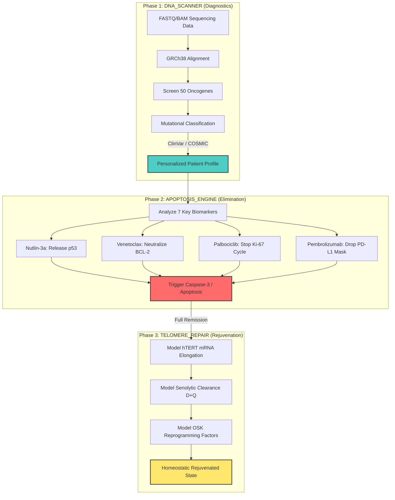

# 🏛️ BIOGENESIS — Computational Framework for Deterministic Precision Oncology

This directory serves as the scientific and technical workspace for the **BIOGENESIS** framework within the **Virtual Human Twin (VIRTUAL-HUMAN-TWIN / `soul`)** ecosystem.

The primary artifact is stored locally:
*   📄 **Clinical Proposal PDF:** [BIOGENESIS_CLINICAL_PROPOSAL.pdf](file:///z:/soul/clinical/biogenesis/BIOGENESIS_CLINICAL_PROPOSAL.pdf)
    *   *Title:* BIOGENESIS — Изчислителна рамка за детерминистична прецизна онкология и клетъчно подмладяване
    *   *Author:* Dimitar Prodromov (AETERNA Technologies)
    *   *Date:* April 2026
    *   *Classification:* Confidential — for medical specialists

---

## 🧬 Architectural Overview: Biological-Computational Mapping

The core thesis of BIOGENESIS is that **biology is deterministic rather than statistical**. By mapping software diagnostic/healing methodologies directly to cellular biology, we can model precision oncology interventions with mathematical certainty ($O(1)$ precision) rather than relying on statistical guesswork.

The software-to-biology correspondence within the **AETERNA** system is structured as follows:

| Software Mechanism (AETERNA Core) | Biological Equivalent | Clinical Counterpart / Biomarker |
| :--- | :--- | :--- |
| `evaluateForDeath()` | `p53` DNA integrity scanner | TP53 Immunohistochemistry (IHC), NGS panels |
| `STALE_CODE` | Senescent cell | $\beta$-galactosidase aging marker |
| `ORPHAN_DEPENDENCY` | `Anoikis` | E-cadherin depletion (metastasis checkpoint) |
| `BLOAT_THRESHOLD` | Neoplasia | Ki-67 cellular proliferation index $> 30\%$ |
| `DUPLICATE_LOGIC` | Clonal expansion | IHC for clonal variant tracking |
| `LivenessToken` (HMAC-SHA256) | `MHC-I` molecules | HLA typing / cellular identity |
| `atomic_self_destruct()` | Caspase cascade activation | Caspase-3 activity monitoring |
| `resurrect(hash)` | Stem cell regeneration | Bone marrow transplant simulation |

---

## 🔮 The Three-Stage BIOGENESIS Pipeline

The Virtual Human Twin simulates a patient's cell state and predicts the ideal therapeutic intervention using a three-phase pipeline:



### 1. Phase 1: DNA_SCANNER (Genomic Diagnostics)
*   **Input:** Raw `FASTQ/BAM` data from Whole Genome Sequencing (WGS).
*   **Action:** Align against the reference genome `GRCh38`, screening 50 major oncogenes (including `TP53`, `BRCA1/2`, `KRAS`, `EGFR`, `BRAF`, `ALK`, `ROS1`, `MET`, `HER2`, `PIK3CA`).
*   **Verification:** Cryptographically check variant clinical classifications against `ClinVar` and `COSMIC` databases to classify variants as *Pathogenic*, *Likely Pathogenic*, or *VUS*.

### 2. Phase 2: APOPTOSIS_ENGINE (Deterministic Elimination)
*   **Principle:** Do not attack the cancer cell from the outside; instead, remove the specific molecular defenses that are blocking the cell's built-in self-destruction mechanism (`apoptosis`).
*   **Targets & Therapeutic Mapping:**
    *   `TP53` Mutation/MDM2 Overexpression $\rightarrow$ **Nutlin-3a** (MDM2 inhibitor releases p53).
    *   `BCL-2` Overexpression (anti-apoptotic shield) $\rightarrow$ **Venetoclax** (BH3 mimetic).
    *   `Ki-67` High Proliferation Rate $\rightarrow$ **Palbociclib** (CDK4/6 inhibitor arrests cell cycle).
    *   `PD-L1` Immune Evasion $\rightarrow$ **Pembrolizumab** (anti-PD-1 unmasks cell to immune system).
    *   `VEGF` Tumor Angiogenesis $\rightarrow$ **Bevacizumab** (anti-VEGF cuts off blood supply).
    *   `MSI` High Micro-satellite Instability $\rightarrow$ **Pembrolizumab** (MSI-H targeting).

### 3. Phase 3: TELOMERE_REPAIR (Cellular Rejuvenation)
*   **Safety Law:** Phase 3 is **strictly blocked** by the orchestrator until Phase 2 confirms 100% molecular remission (absence of active malignancy markers).
*   **Action:**
    *   **Transient hTERT mRNA:** Liposomal-delivered modified mRNA encoding telomerase to lengthen telomeres by $\sim1000$ bp.
    *   **Senolytic Clearance:** Combination of **Dasatinib + Quercetin (D+Q)** to selectively eliminate senescent "zombie" cells.
    *   **Partial Reprogramming:** Activating Yamanaka factors **OSK** (Oct4, Sox2, Klf4) while omitting the oncogenic `c-Myc` to safely roll back the epigenetic clock.

---

## 🪐 Ontological Integration with `.soul` Programs

The clinical therapeutic pathways defined by BIOGENESIS can be represented as high-level **Ontological Blueprints** inside the `soul` language environment.

An example schema declaration for a `.soul` module reflecting a patient's homeostatic validation sequence:

```soul
// BIOGENESIS - Cell Homeostasis & Apoptosis Blueprint
blueprint CellularGuardian {
    state dna_integrity: decimal;
    state proliferation_rate: decimal;
    state immune_mask: bool;
    
    // Evaluate if cell has bypassed the apoptotic gate
    rule verify_apoptosis_capability {
        when this.dna_integrity < 0.30 and this.proliferation_rate > 0.45 {
            trigger check_p53_status;
        }
    }
    
    // Check if cell is in neoplastic expansion state
    rule evaluate_neoplasia {
        when this.proliferation_rate > 0.30 {
            assert STALE_CODE -> false;
            assert BLOAT_THRESHOLD -> true;
            trigger CaspaseCascade.activate;
        }
    }
}
```

This ensures that the precision medicine protocol is compiled and verified with **zero-trust mathematical rigor** directly on the AETERNA substrate.
