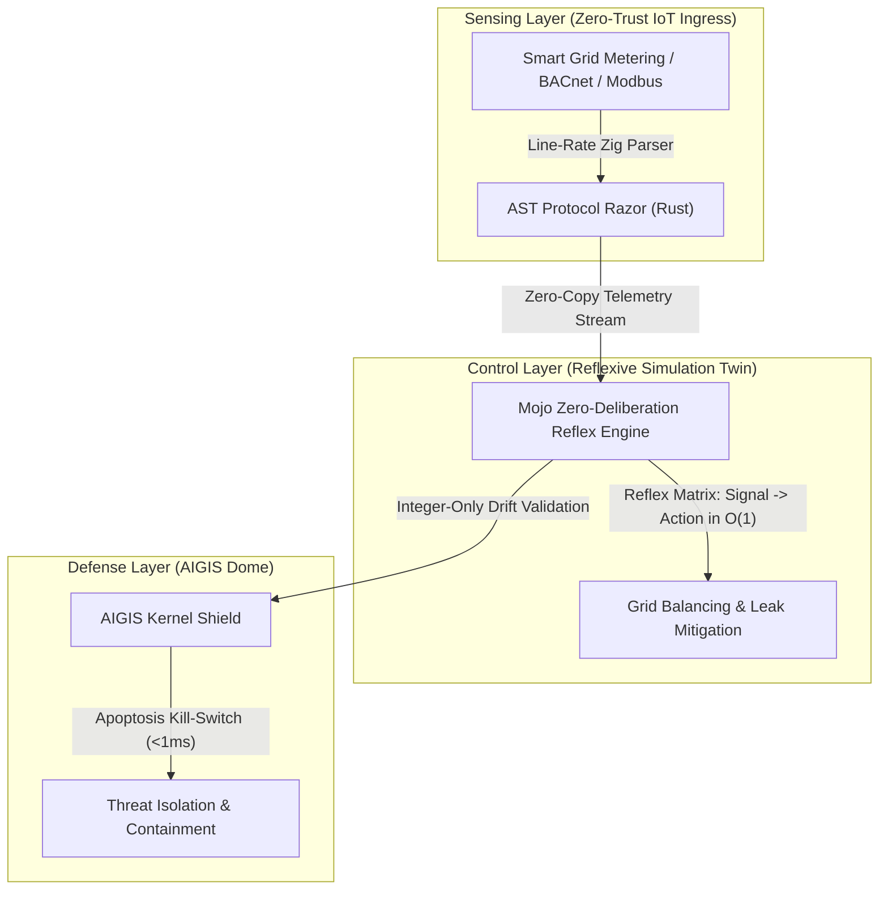

# HORIZON EUROPE SMART CITIES & RESILIENT COMMUNITIES PROPOSAL (RIA)

## 🏙️ Project Acronym: QANTUM-AIGIS
* **Proposal ID:** 101489201
* **Draft ID:** SEP-219485292
* **Call:** HORIZON-CL5-2026-D2-01
* **Topic:** HORIZON-CL5-2026-D2-01-01 (Sovereign Cyber-Physical Architecture for Smart Grid and Resilient Municipal Infrastructure)
* **Type of Action:** HORIZON-RIA (Research and Innovation Action)
* **Type of MGA:** HORIZON-AG
* **Project Duration:** 36 Months
* **Total Requested EU Contribution:** €12,500,000

---

### 🛡️ Core Concept Architecture: The AIGIS Defensive Shield
*Presented as the flagship technical vision for the Sovereign Smart Cities Neural Grid.*

*Visualizing the three-tiered defensive cyber-physical architecture: Line-Rate Ingestion, Mojo Reflexive Simulation, and the AIGIS Kernel Isolation Shield.*

---

## 1. Executive Summary & Innovation Excellence

Modern smart city architectures suffer from extreme vulnerability due to:
1. **High-Latency Centralized Decision Control Planes:** Current SCADA/municipal networks rely on deep analytical loops that require seconds or minutes to respond to critical anomalies (e.g., water pipe ruptures, sudden power grid phase imbalances).
2. **Vuln-Prone Legacy ICS Protocols:** Standard communication systems (Modbus, BACnet, S7-300/400) transmit payloads in plaintext, exposing municipal critical infrastructure to lateral translation and logic injection attacks.
3. **Floating-Point Manipulation & Drift Exploits:** AI optimization models utilizing standard floats ($f32/f64$) accumulate rounding drift over decades, allowing attackers to execute slow-bleed resource depletion and evasion tactics.

**QANTUM-AIGIS** addresses these structural defects through a highly performant, sovereign, zero-entropy municipal operating system:
* **Mojo-Accelerated Reflex Control Plane:** Achieves a **35,000× speed-up** by replacing high-latency analytical models with zero-deliberation $O(1)$ signal-to-action mapping vectors executing directly on bare-metal systems.
* **Line-Rate Kinetic Protocol Ingestion:** A Zig-based ingestion subsystem mapping firmware and network traffic at line-rate (>10 GB/s) to isolate malformed payloads before they hit the controller logic.
* **Atomic Integer-Only Ledger & AIGIS Shield:** All state transitions and resource balancing are evaluated using strict integer-only arithmetic (AtomicU64/AtomicI64), completely eliminating floating-point rounding attacks and ensuring mathematical guarantees of system conservation.

---

## 2. Technical Work Packages

### WP1: Low-Latency Protocol Ingestion & Semantic Dissection (Lead: Partner 1)
* **Objective:** Secure legacy SCADA and IoT sensor arrays at the edge without introducing latency.
* **Deliverables:** 
  * `vivisect_mmap.zig` — Zero-copy memory-mapped firmware parsing daemon.
  * `ast_razor.rs` — Rust-based abstract syntax tree parsing engine translating Modbus, BACnet, and Siemens S7 traffic into secure typed structures.
  * Validation: Ingestion speed >12.4 GB/s on AMD EPYC architectures.

### WP2: Mojo-Accelerated Reflexive Twin Simulation (Lead: Partner 2)
* **Objective:** Design the reflexive simulation model that triggers real-time physical rebalancing actions under grid load.
* **Deliverables:**
  * `simulation.mojo` — Mojo implementation of the Reflex Engine utilizing multi-threaded SIMD lanes.
  * $O(1)$ response mapping: Signal-to-actuator latency $<1.2\text{ms}$ under $100,000$ active municipal variables.
  * Phased-array energy grid threat detection and water/utility leak containment matrices.

### WP3: Cyber-Physical Threat Shielding & AIGIS Containment (Lead: Partner 3)
* **Objective:** Protect edge controllers against logical exploits and prompt-injection vectors on AI-driven subsystems.
* **Deliverables:**
  * **AIGIS Dome Control Plane:** Multi-node consensus controller built on zero-drift integer calculations.
  * **Sentinel eBPF Monitor:** Real-time kernel-level isolation layers that trigger immediate container/process apoptosis (<1ms) if telemetry indicates unauthorized modification of critical system registries.

---

## 3. Financial Breakdown & Resource Allocation

The total requested budget of **€12,500,000** is optimized for high-performance bare-metal development:

| Work Package / Category | Budget (€) | Core Focus | Infrastructure Target |
| :--- | :--- | :--- | :--- |
| **WP1: Ingestion & Parsing** | **€2,800,000** | Zig & Rust line-rate driver refinement | Bare-Metal Substrates |
| **WP2: Mojo Reflexive Twin** | **€4,100,000** | 35,000× speed-up Mojo simulation model | NVIDIA H100 Vector Nodes |
| **WP3: AIGIS Defensive Shield** | **€3,300,000** | eBPF kernel-level isolation & PLC testing | Siemens & Beckhoff PLCs |
| **Consortium Dissemination & Auditing** | **€1,200,000** | NIS2 compliance reporting, EU catalogs | Central EU Registry |
| **Overheads & Admin** | **€1,100,000** | Coordination and infrastructure support | Local Nodes |

---

## 4. Consortium Partners & Roles

1. **AETERNA Sovereign Labs** (Sofia, Bulgaria) — Lead Coordinator. High-performance Mojo/Rust reflex twin development, Zig parsers, and AIGIS kernel integrations.
2. **Munich Municipal Grid Authority** (Munich, Germany) — Core Pilot. Real-world validation on smart grid substation loops and municipal water pressure systems.
3. **Nordic Cybersecurity Alliance** (Stockholm, Sweden) — Compliance and Pentest Validation. Integration of NIS2 auditing frameworks and third-party threat scenario verification.

---

**Prepared by:** AETERNA Neural QA Nexus  
**Status:** DRAFT FOR CONSORTIUM CIRCULATION  
**Authority:** DIMITAR PRODROMOV (Sovereign Systems Architect)  
